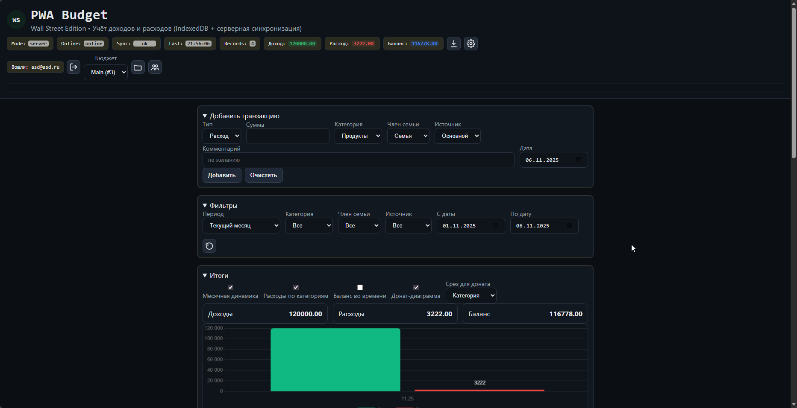

# PWA Budget

Учёт доходов и расходов с офлайн‑режимом, аналитикой и синхронизацией через локальный API. Готово к быстрому развёртыванию локально или на сервере.

**Для чего проект**
- Личный и семейный учёт бюджета: доходы/расходы, баланс и итоги.
- Совместная работа: общие бюджеты, роли и приглашения участников.
- Офлайн‑режим без сервера, с последующей синхронизацией при появлении сети.
- Базовая аналитика: фильтры по периодам/категориям и графики (динамика, распределение).
- Импорт/экспорт (JSON/CSV) для переноса и резервного копирования.
- Простой локальный API для интеграции и автоматизации.

**Возможности**
- CRUD транзакций с атрибутами (категория, участник, источник, дата, комментарий, сумма).
- Фильтрация по периодам и метаданным; сводные итоги (доход/расход/баланс).
- Аналитика на Chart.js: месячная динамика, расходы по категориям, распределение по измерению.
- Импорт/экспорт данных (JSON, CSV), экспорт графиков (PNG).
- Два режима: локальный (IndexedDB, PWA) и серверный (REST + SSE) с бюджетами и приглашениями.
- Информационный тикер с автообновлением данных криптовалют через локальный прокси CoinGecko.
- Справочники (редактируемые): категории, участники, источники.

**Кратко о PWA-Budget2 (описание репозитория)**
- PWA для учёта бюджета с офлайн‑режимом, совместной работой и графиками.
- Локальный IndexedDB, серверная синхронизация (Express + REST/SSE), импорт/экспорт.
- Готово к публикации и запуску API на любом Node‑хостинге.

**Технологии**
- Фронтенд: Vanilla JS (ES‑modules), IndexedDB, Chart.js, PWA (Service Worker + Web Manifest).
- Бэкенд: Node.js + Express, хранение в JSON‑файлах, REST API, Server‑Sent Events, CoinGecko‑прокси.
- Синхронизация: bulk‑операции, идемпотентность по хэшу содержимого и параметрам сделки, авто‑push.

**Быстрый запуск**
- Windows/PowerShell:
  - API: `PowerShell ./projects/pwa-budget2/server/run.ps1 -Port 8050`
  - Статика: `PowerShell ./projects/pwa-budget2/dev-server.ps1 -Port 9090`
  - Открыть `http://127.0.0.1:9090/projects/pwa-budget2/`
- Node.js:
  - API: `cd projects/pwa-budget2/server && npm install && npm start`
  - Статика: `node projects/pwa-budget2/dev-server.js` или `npx http-server -p 9090 -c-1 -a 127.0.0.1 projects/pwa-budget2`
- PWA: Service Worker (в проде) регистрируется автоматически; ассеты кешируются, данные — в IndexedDB.

**Развёртывание где угодно**
- (статическая часть):
  - Скопируйте содержимое `projects/pwa-budget2/` в любую директорию.
  - Приложение работает офлайн. Для серверных функций (регистрация, бюджеты, синхронизация, тикер‑прокси) укажите API‑хост (см. ниже).
- Сервер API (Express):
  - Запустите `projects/pwa-budget2/server/` на любом Node‑хостинге.
  - Переменная окружения: `PORT` (по умолчанию `8050`).
  - Данные сохраняются в `projects/pwa-budget2/server/data/` (создаётся автоматически).
- Автонастройка API‑URL:
  - В проде клиент подхватывает `window.location.origin` и путь `/api/*` (включая вариант подкаталога `/money/api/*`).
  - На localhost по умолчанию используется `http://127.0.0.1:8050`.
  - При недоступности сервера функциональность падает в локальный режим.

**Архитектура**
- `src/app.js` — бизнес‑логика, фильтрация, итоги, интеграция графиков и синхронизации.
- `src/ui.js` — рендер списка транзакций и итогов.
- `src/charts.js` — построение графиков (Chart.js).
- `src/db.js` — IndexedDB: CRUD и хранение метаданных.
- `src/sync.js` — клиент REST/SSE: авторизация, бюджеты, транзакции, события.
- `src/extra.js` — фильтры аналитики, экспорт, тикер.
- `service-worker.js` — кеширование ассетов и офлайн‑режим.
- `server/index.js` — Express API: бюджеты, пользователи, транзакции, SSE, CoinGecko‑прокси.

**Примечания по данным и приватности**
- Пользовательские JSON‑файлы API (`server/data/*`) исключены из репозитория (.gitignore), чтобы публикация на GitHub не включала тестовые учётные записи и сессии.
- Для быстрого демо используйте регистрацию локально или добавьте фикстуры через API.

**API**
- Авторизация: `POST /api/register`, `POST /api/login`, `GET /api/me`.
- Бюджеты: `GET/POST/PUT/DELETE /api/budgets`, приглашения: `POST /api/budgets/:id/members`, `POST /api/invitations/:token/accept`.
- Транзакции (bulk): `POST /api/transactions/bulk` (идемпотентность, дедупликация, маппинг идентификаторов).
- События (SSE): `GET /api/events?budgetId=...&token=...`.
- Крипто‑прокси: `GET /api/crypto/coins-list`, `GET /api/crypto/simple-price?...`.

**Лицензия**
MIT